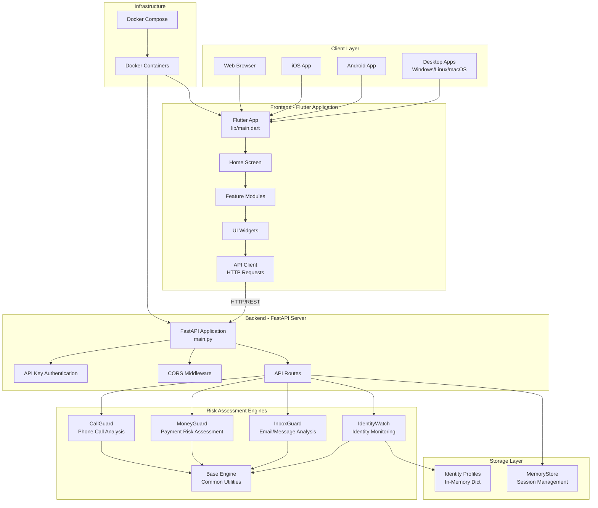
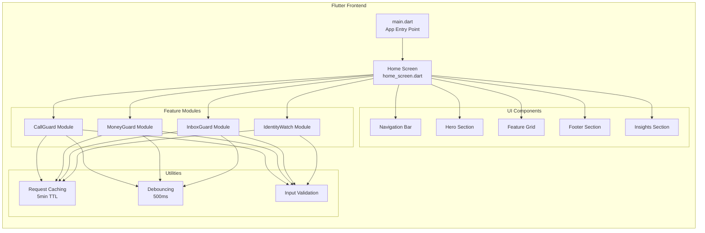
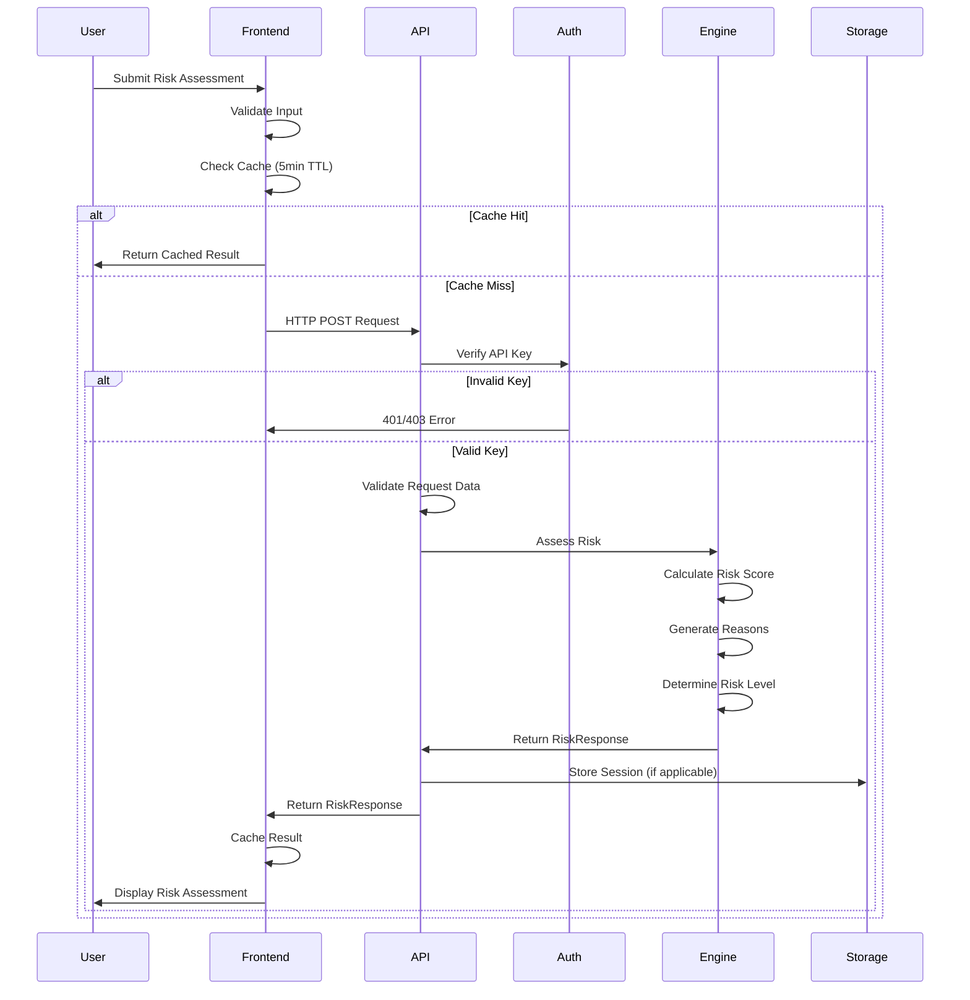
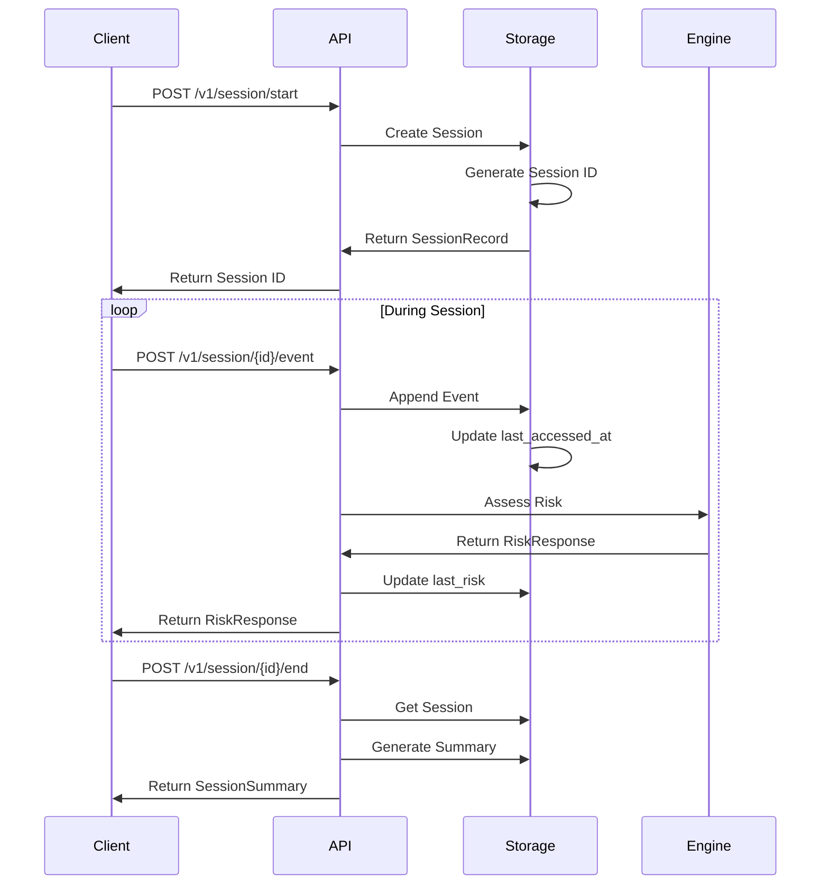
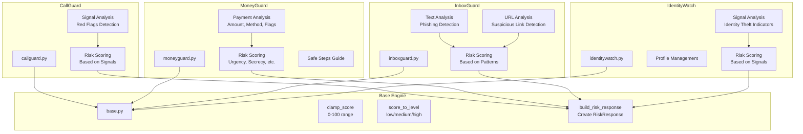
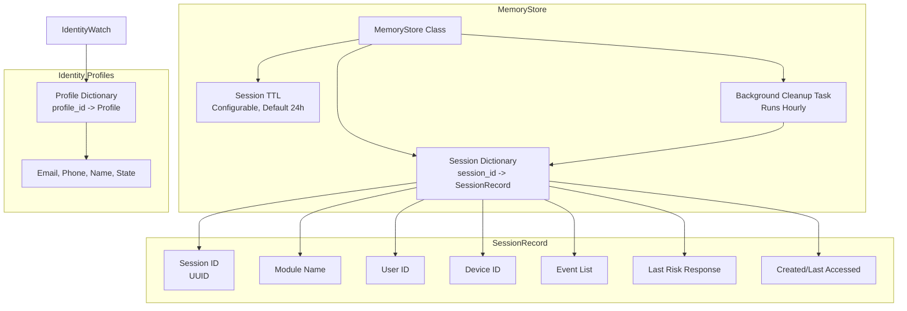
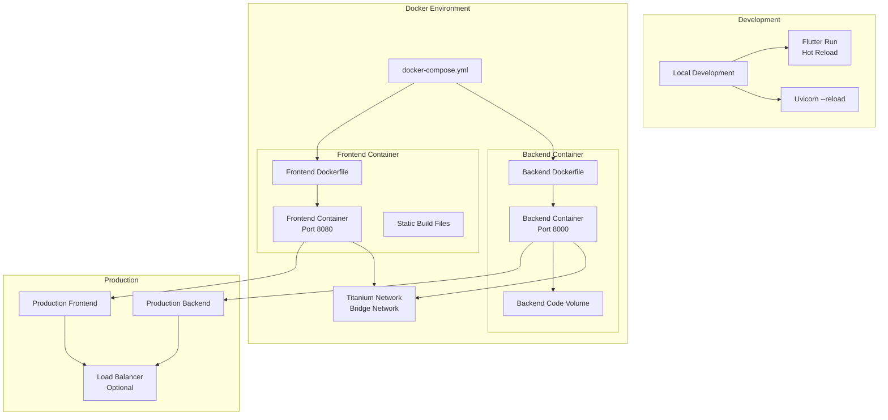

# Architecture Diagram

## System Overview

The Titanium Guardian application is a cybersecurity risk assessment platform designed for senior citizens. It consists of a cross-platform Flutter frontend and a Python FastAPI backend with specialized risk assessment engines.

## High-Level Architecture



## Detailed Component Architecture

### Frontend Architecture



### Backend Architecture

```mermaid
graph TB
    subgraph "API Layer"
        Endpoints[API Endpoints]
        SessionAPI[/v1/session/*<br/>Session Management]
        MoneyAPI[/v1/moneyguard/*<br/>Payment Assessment]
        InboxAPI[/v1/inboxguard/*<br/>Message Analysis]
        IdentityAPI[/v1/identitywatch/*<br/>Identity Monitoring]
    end

    subgraph "Request Processing"
        Validation[Input Validation<br/>Pydantic Models]
        Auth[API Key Verification]
        ErrorHandling[Error Handling<br/>& Logging]
    end

    subgraph "Risk Engines"
        CallGuard[CallGuard Engine]
        MoneyGuard[MoneyGuard Engine]
        InboxGuard[InboxGuard Engine]
        IdentityWatch[IdentityWatch Engine]
    end

    subgraph "Storage"
        Sessions[Session Storage<br/>MemoryStore]
        ProfileStorage[Profile Storage<br/>In-Memory Dict]
    end

    Endpoints --> SessionAPI
    Endpoints --> MoneyAPI
    Endpoints --> InboxAPI
    Endpoints --> IdentityAPI

    SessionAPI --> Validation
    MoneyAPI --> Validation
    InboxAPI --> Validation
    IdentityAPI --> Validation

    Validation --> Auth
    Auth --> ErrorHandling

    SessionAPI --> CallGuard
    MoneyAPI --> MoneyGuard
    InboxAPI --> InboxGuard
    IdentityAPI --> IdentityWatch

    CallGuard --> Sessions
    MoneyGuard --> Sessions
    InboxGuard --> Sessions
    IdentityWatch --> ProfileStorage
    IdentityWatch --> Sessions
```

## Data Flow

### Risk Assessment Flow



### Session Management Flow



## Risk Engine Architecture



## Storage Architecture



## Deployment Architecture



## Technology Stack

### Frontend
- **Framework**: Flutter (Dart)
- **Platforms**: Web, iOS, Android, Windows, Linux, macOS
- **State Management**: Flutter StatefulWidget
- **HTTP Client**: Dart http package
- **Caching**: In-memory cache with TTL
- **Accessibility**: ARIA labels, semantic widgets, keyboard navigation

### Backend
- **Framework**: FastAPI (Python)
- **Server**: Uvicorn (ASGI)
- **Validation**: Pydantic models
- **Authentication**: API Key (X-API-Key header)
- **CORS**: FastAPI CORS middleware
- **Logging**: Python logging module
- **Storage**: In-memory (MemoryStore) - can be extended to database

### Infrastructure
- **Containerization**: Docker
- **Orchestration**: Docker Compose
- **CI/CD**: GitHub Actions (configured)
- **Testing**: pytest (backend), Flutter test (frontend)

## Key Design Patterns

1. **Modular Risk Engines**: Each risk assessment module (CallGuard, MoneyGuard, etc.) is independent and follows a common interface
2. **Session-Based Assessment**: Supports multi-event sessions for complex risk scenarios
3. **Stateless API**: Backend is stateless except for session storage (can be moved to external database)
4. **Caching Strategy**: Frontend caches API responses to reduce load and improve UX
5. **Input Validation**: Multiple layers of validation (frontend, Pydantic models, risk engines)
6. **Error Handling**: Comprehensive error handling with user-friendly messages
7. **Background Tasks**: Session cleanup runs as a background daemon thread

## Security Considerations

- API Key authentication for backend access
- Input validation and sanitization
- CORS configuration (currently permissive for development)
- Session TTL to prevent indefinite storage
- No sensitive data in logs
- Environment variable configuration for secrets

## Future Enhancements

- Database integration for persistent storage
- Redis for session management
- Rate limiting
- OAuth2/JWT authentication
- WebSocket support for real-time updates
- Analytics and monitoring integration
- Multi-tenant support

